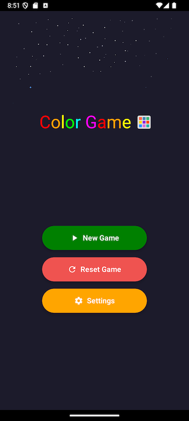
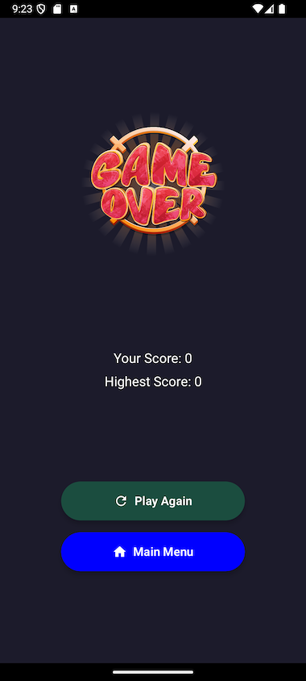
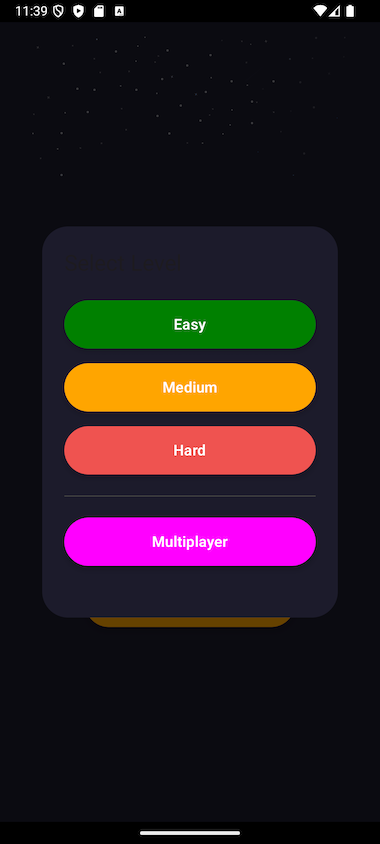

# Color Game

This project is a simple game app inspired a video on youtube. The game is very simple with only rule, **Tap on the wrong color**. The game is built using **Kotlin** and **Android SDK**. It uses **MVVM architecture** and **Jetpack Compose** for the UI.:
- Youtube Video URL: [Video] https://youtube.com/shorts/DrrXOACjheM?si=WAM-z7CHMr5TghQc

The game is very simple with only one rule, **Tap on the wrong color**. 
The game is built using **Kotlin** and **Android SDK**. It uses **MVVM architecture** and **Jetpack Compose** for the UI.

## Screenshots




## Features

- **Single Player Mode:** Play against the clock.
- **Multiplayer Mode:** Compete with friends.
- **Leaderboard:** Track high scores.
- **Settings:** Customize game preferences.
- **Animations:** Smooth transitions and effects.
- **Sound Effects:** Engaging audio feedback.
- **Responsive Design:** Optimized for various screen sizes.


## Tech Stack

- **Language:** Kotlin, SwiftUI
- **Architecture:** MVVM (Shared ViewModel)
- **UI:** Fragments, ConstraintLayout, Custom Views


## Getting Started

1. Clone the repo:
   ```bash
   git clone https://github.com/damian-tochi/ColorGame.git

2. Open in Android Studio
   - Open Android Studio.
   - Choose "Open an existing project" and select the cloned directory.

3. Build & Run
   - Sync Gradle.
   - Connect a device or launch an emulator.
   - Press Run.


## APK Download/Installation
- 
